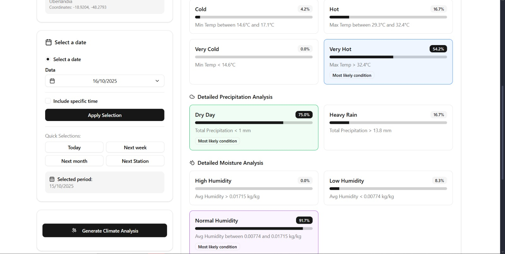

<div align="center">
  <h1>Nasa Space Apps Challenge 2025</h1>
  <h2>Will It Rain On My Parade?</h2>
  <p>Uma aplicação web que utiliza décadas de dados da NASA para prever a <strong>probabilidade</strong> de condições climáticas para planejamento de eventos a longo prazo.</p>

  
  
  

</div>

---

###  About Our Project
Planning an outdoor event, trip, or hike months in advance always involves uncertainty about the weather. Traditional weather forecasts only cover the next few weeks, leaving long-term planning to chance.

Our solution is a comprehensive web application that solves this problem. Using a vast collection of historical NASA data, our system calculates the **climatological probability** of specific weather conditions (such as extreme heat, heavy rain, or low humidity) for any location on the planet, on any day of the year. With an interactive interface, users can make smarter decisions and better prepare for their future activities.

---

### 🚀 The NASA Challenge
This project is our submission to the **NASA Space Apps Challenge 2025**, under the **"Will It Rain On My Parade?"** challenge. The goal was to create a tool that would allow users to check the probability of severe weather conditions for a specific location and date, using NASA's Earth observation data for more effective planning.

---

###  Features
- **Climate Probability Analysis:** Calculations for Temperature, Precipitation, and Humidity.
- **Interactive Interface:** Map for easy and accurate selection of any location in the world.
- **Daily and Hourly Analysis:** Get the probability for an entire day or a specific hour.
- **Consistent NASA Data:** Uses the GLDAS model as the primary source, ensuring consistency between variables.
- **Robust Backend:** A RESTful API built with Flask to process statistical analyses.
- **Clear Visualization:** Results are presented in a simple and intuitive way.


---

###  How It Works
The application offers a fluid and straightforward user experience for data querying.

**1. Select a Location on the Map**
Open the application and, on the interactive map, select the exact location you want to analyze.

**2. Choose the Date**
Use the date selector to select the day for which you want the analysis. The year doesn't matter, as the analysis is based on the history for that day and month.

<div align="center">


</div>

**3. View Odds**
The app instantly displays historical probabilities for the selected day, showing the chances of conditions such as "Heavy Rain," "Low Humidity," "Very Hot," etc.

<div align="center">



</div>

<div align="center">


</div>

---

### 💻 Technologies
This project is a full-stack application that uses the following technologies:

| 
Category | Technology |
|-----------|------------|
| Backend   | Python, Flask, Pandas |
| Frontend  | React |
| Data Source | NASA Giovanni API (Modelo GLDAS) |

---

### 🚀 How to Run
Follow the steps below to run the project locally.

#### Prerequisites
- Python 3.9+
- Node.js e npm (ou Yarn)
- A `.netrc` file in your home folder with your NASA Earthdata credentials.

#### Backend
```bash
# 1. Clone the repository
git clone [https://github.com/MeloLuc/Nasa-Space-Apps-Challenge-2025.git](https://github.com/MeloLuc/Nasa-Space-Apps-Challenge-2025.git)

cd Nasa-Space-Apps-Challenge-2025/backend

# 2. Create a virtual environment and install dependencies
python -m venv .venv
source .venv/bin/activate  # No Windows: .venv\Scripts\activate
pip install -r requirements.txt

# 3. Run the data collectors (do this for each city and variable)
python coletor_temperatura.py
python coletor_precipitacao.py
python coletor_umidade.py

# 4. Start the Flask server
flask --app app run

#### Frontend

# Navigate to the frontend folder
cd ../frontend

# Install dependencies
npm install

# Launch the application
npm start

# XBigDevs
- Cauã Cavalcante Gonçalves
- Ivo Henrique Lima dos Santos
- Lucas de Melo Monteiro Peixoto  
- Paulo Ricardo Oliveira Santos 
- Rafael Rocha dos Santos
- Thiago Araujo Silva  
